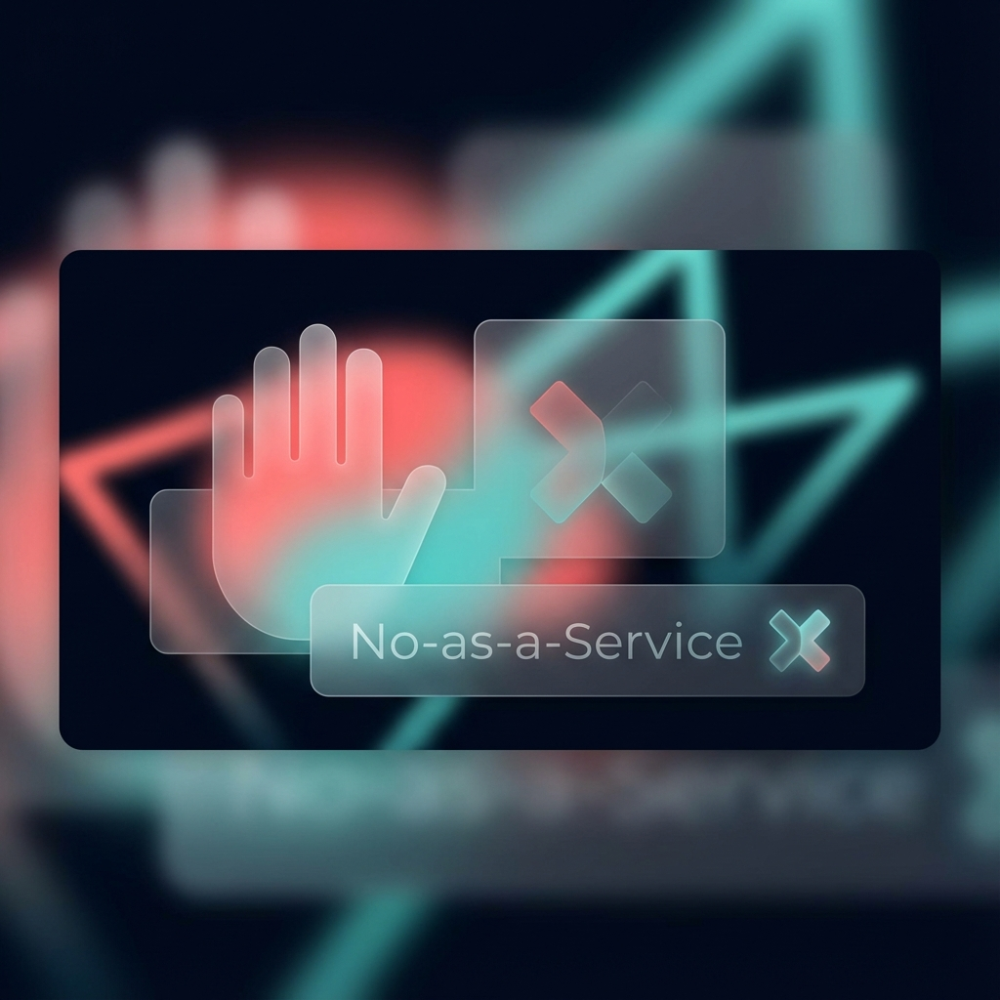

# No-as-a-Service (NaaS)



<div align="center">


</div>

**No-as-a-Service** is your premier solution for saying "No" with style. Whether you need a quick, classic excuse or a custom, AI-crafted rejection, we've got you covered.

## Features

*   **Classic Mode**: Instant access to a curated list of timeless excuses.
*   **AI Enhanced Mode**: Generate context-aware rejections using advanced AI models (Google Gemini, OpenAI, Ollama).
*   **Multi-Language Support**: Get rejections in English, Tamil, and more.
*   **Slack Integration**: Send your generated rejections directly to a Slack channel.
*   **Smart & Witty**: AI mode understands context to provide the perfect "No" for any situation.

## Built With

*   [Next.js 16](https://nextjs.org/) - The React Framework for the Web
*   [React 19](https://react.dev/) - The library for web and native user interfaces
*   [Google Gemini](https://ai.google.dev/) - Multimodal AI model (@google/generative-ai)
*   [OpenAI](https://openai.com/) - AI model provider
*   [Ollama](https://ollama.com/) - Local AI model runner
*   [Zoho Catalyst](https://catalyst.zoho.com/) - Serverless Cloud Platform with App Sail and Slate

## Getting Started

First, run the development server:

```bash
npm run dev
# or
yarn dev
# or
pnpm dev
# or
bun dev
```

Open [http://localhost:3000](http://localhost:3000) with your browser to see the result.

You can start editing the page by modifying `app/page.tsx`. The page auto-updates as you edit the file.

This project uses [`next/font`](https://nextjs.org/docs/app/building-your-application/optimizing/fonts) to automatically optimize and load [Geist](https://vercel.com/font), a new font family for Vercel.

## Learn More

To learn more about Next.js, take a look at the following resources:

- [Next.js Documentation](https://nextjs.org/docs) - learn about Next.js features and API.
- [Learn Next.js](https://nextjs.org/learn) - an interactive Next.js tutorial.

You can check out [the Next.js GitHub repository](https://github.com/vercel/next.js) - your feedback and contributions are welcome!

## Deploy on Zoho Catalyst

To deploy this Next.js application on [Zoho Catalyst](https://catalyst.zoho.com/), follow these steps:

1.  **Install Catalyst CLI**:
    ```bash
    npm install -g zcatalyst-cli
    ```

2.  **Login to Catalyst**:
    ```bash
    catalyst login
    ```

3.  **Initialize Project**:
    Run the following command in your project root:
    ```bash
    catalyst init
    ```
    -   Select your project.
    -   Choose **App Sail** (for hosting Next.js as a server-side app) or **Web Client** (for static export). *Recommended: App Sail for full Next.js features.*

4.  **Deploy**:
    ```bash
    catalyst deploy
    ```

For detailed instructions, refer to the [Catalyst Documentation](https://docs.catalyst.zoho.com/).

## Deploy via Catalyst Slate (Git Integration)

**Catalyst Slate** allows you to deploy your application directly from your GitHub repository with automatic updates on every push.

1.  **Push to GitHub**: Ensure your latest code is pushed to your GitHub repository.
2.  **Open Catalyst Console**: Go to the [Zoho Catalyst Console](https://console.catalyst.zoho.com/).
3.  **Navigate to Slate**: In your project, select **Slate** from the left sidebar.
4.  **Create App**: Click **Create New App**.
5.  **Connect GitHub**: Select **GitHub** as your source and authorize Zoho Catalyst.
6.  **Select Repository**: Choose the `NoAsAService` repository.
7.  **Configure Build**:
    -   **Framework**: Next.js
    -   **Build Command**: `npm run build`
    -   **Output Directory**: `.next` (or `out` if using static export)
8.  **Deploy**: Click **Deploy**. Your app will be live and will auto-deploy on future commits.

## Inspiration

This project is inspired by [No-as-a-Service](https://github.com/hotheadhacker/no-as-a-service) by hotheadhacker. We built upon the original concept to include AI-powered rejections, multi-language support, and integrations.
